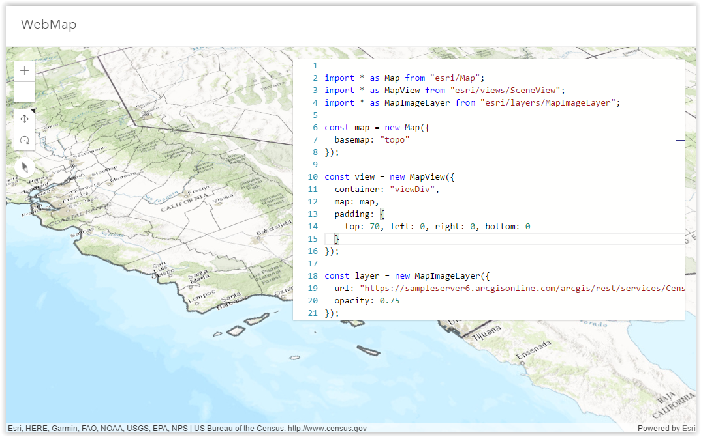

# Live Demo Coding Application
Bootstrap application that allows the presenter to live code and get the demo updated at runtime.



# Usage

```
npm install
```

then browse to the `index.html` page.

To update the compiled app, edit the code on the right and hit `Ctrl+s`.

# Creating new pages

I used convention to quickly create new demo apps. Here are the steps to follow to create new ones:
 - Duplicate `src/demo` and give it a name like `src/demo2`
 - Duplicate `index.html` and give it a name like `index2.html`
 - Edit `index2.html`
   - update the application name `var app = "demo2"`;
   - update the typescript code that will be executing. Let's display a simple scene:
```html
<script id="typescriptSample" type="text/typescript">
import * as Map from "esri/Map";
import * as SceneView from "esri/views/SceneView";

const map = new Map({
  basemap: "topo-vector"
});

const view = new SceneView({
  container: "viewDiv",
  map: map
});
</script>
```
   - optionally, update the content of the iframe `src/demo2/iframe.html`. This is where the SceneView's container `viewDiv` is defined for example.
   - optionally, update the text content of this script tag `<script id="typescriptExtraLib" type="text/typescript"></script>` in `index2.html` to declare the typescript context.  
```html
<script id="typescriptExtraLib" type="text/typescript">
import * as Map from "esri/Map";
declare var map: Map;
</script>
<script id="typescriptSample" type="text/typescript">
import * as SceneView from "esri/views/SceneView";

const view = new SceneView({
  container: "viewDiv",
  map: map
});
</script>
```
